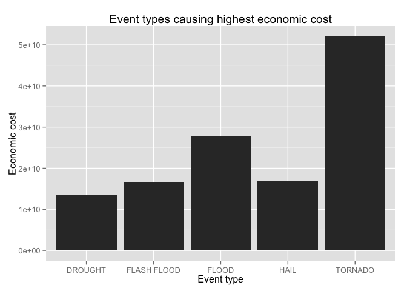

# Storm data analysis

This document analyses storm data provided by U.S. National Oceanic and Atmospheric Administration (NOAA). Analysis is done on data to find most harmful event types for population health (injuries, fatalities) and economic (property & crop damages).

## Data Processing

First we download packaged dataset, unpack it and load resulting dataset.

```r
    library(R.utils)
```

```
## Loading required package: R.oo
## Loading required package: R.methodsS3
## R.methodsS3 v1.7.0 (2015-02-19) successfully loaded. See ?R.methodsS3 for help.
## R.oo v1.19.0 (2015-02-27) successfully loaded. See ?R.oo for help.
## 
## Attaching package: 'R.oo'
## 
## The following objects are masked from 'package:methods':
## 
##     getClasses, getMethods
## 
## The following objects are masked from 'package:base':
## 
##     attach, detach, gc, load, save
## 
## R.utils v2.1.0 (2015-05-27) successfully loaded. See ?R.utils for help.
## 
## Attaching package: 'R.utils'
## 
## The following object is masked from 'package:utils':
## 
##     timestamp
## 
## The following objects are masked from 'package:base':
## 
##     cat, commandArgs, getOption, inherits, isOpen, parse, warnings
```

```r
    if(!file.exists("./data/stormdata.csv")) {
        fileUrl <- "https://d396qusza40orc.cloudfront.net/repdata%2Fdata%2FStormData.csv.bz2"
        download.file(fileUrl, destfile="./data/stormdata.bz2", method="curl")
        bunzip2("./data/stormdata.bz2", "./data/stormdata.csv")        
    }
    data <- read.csv("./data/stormdata.csv")        
```

First question we look into is which event types (EVTYPE) are most harmful for persons, e.g. which create most fatalities and injuries.

Following code calculates total fatalities and injuries based on EVTYPE.

```r
    ## Use dplyr package
    library(dplyr)
```

```
## 
## Attaching package: 'dplyr'
## 
## The following objects are masked from 'package:stats':
## 
##     filter, lag
## 
## The following objects are masked from 'package:base':
## 
##     intersect, setdiff, setequal, union
```

```r
    ## Create new table which sums fatality & injuries per EVTYPE
    data.evdata = group_by(data, EVTYPE)
    data.harmful <- summarise(data.evdata, fatalities = sum(FATALITIES), injuries = sum(INJURIES),  
                              total = sum (INJURIES + FATALITIES))

    ## Sort table    
    attach(data.harmful)
    data.harmful.sorted <- data.harmful[order(total, decreasing = TRUE) , ]
    detach(data.harmful)
```

Next we look into which event types create most consequences from economic point of view.

Following code converts used multipliers into actual numeric values and calculates total economic values
per event types.

```r
    ## Subset dataset to remove rows with 0 economic cost
    data2 <- subset(data, PROPDMG > 0 | CROPDMG > 0)
    
    ## First convert economic damage multipliers into actual values
    for(i in 1:nrow(data2)) {
        if (data2[i, "PROPDMGEXP"] == "K")
            data2[i, "PROPDMG"] <- data2[i, "PROPDMG"] * 1000
        if (data2[i, "PROPDMGEXP"] == "M")
            data2[i, "PROPDMG"] <- data2[i, "PROPDMG"] * 1000000
        if (data2[i, "CROPDMGEXP"] == "K")
            data2[i, "CROPDMG"] <- data2[i, "CROPDMG"] * 1000
        if (data2[i, "CROPDMGEXP"] == "M")
            data2[i, "CROPDMG"] <- data2[i, "CROPDMG"] * 1000000
    }

    ## Create new table which sums economic damage per EVTYPE
    data.eco = group_by(data2, EVTYPE)
    data.eco.cost <- summarise(data.eco, cost = sum(PROPDMG + CROPDMG))

    ## Sort table
    attach(data.eco.cost)
    data.eco.cost.sorted <- data.eco.cost[order(cost, decreasing = TRUE) , ]
    detach(data.eco.cost)
```


## Results

Following table displays 10 most harmful event types for population.


```r
    ## Select top 10 events & display table
    data.harmful.sorted.top10 <- data.harmful.sorted[1:10, ]
    print.data.frame(data.harmful.sorted.top10)
```

```
##               EVTYPE fatalities injuries total
## 1            TORNADO       5633    91346 96979
## 2     EXCESSIVE HEAT       1903     6525  8428
## 3          TSTM WIND        504     6957  7461
## 4              FLOOD        470     6789  7259
## 5          LIGHTNING        816     5230  6046
## 6               HEAT        937     2100  3037
## 7        FLASH FLOOD        978     1777  2755
## 8          ICE STORM         89     1975  2064
## 9  THUNDERSTORM WIND        133     1488  1621
## 10      WINTER STORM        206     1321  1527
```

It easy to see from the table that biggest risk for population comes from "Tornados". Total amount of fatalities & injuries from tornados is over ten times bigger then next event which is "Excessive Heat".

Following picture displays 5 most harmful event types for economy.


```r
    ## Select top 5 events & display table
    data.eco.cost.sorted.top5 <- data.eco.cost.sorted[1:5, ]

    library(ggplot2)
    g <- ggplot(data.eco.cost.sorted.top5, aes(x = EVTYPE, y = cost)) 
    g <- g + geom_bar(stat="identity")
    g <- g + xlab("Event type")
    g <- g + ylab("Economic cost")
    g <- g + ggtitle("Event types causing highest economic cost")
    print(g)
```

 

From previous picture it is easy to see that biggest economic cost comes from tornados. Tornado impact is almost half as big as impact from floods which is second biggest.

